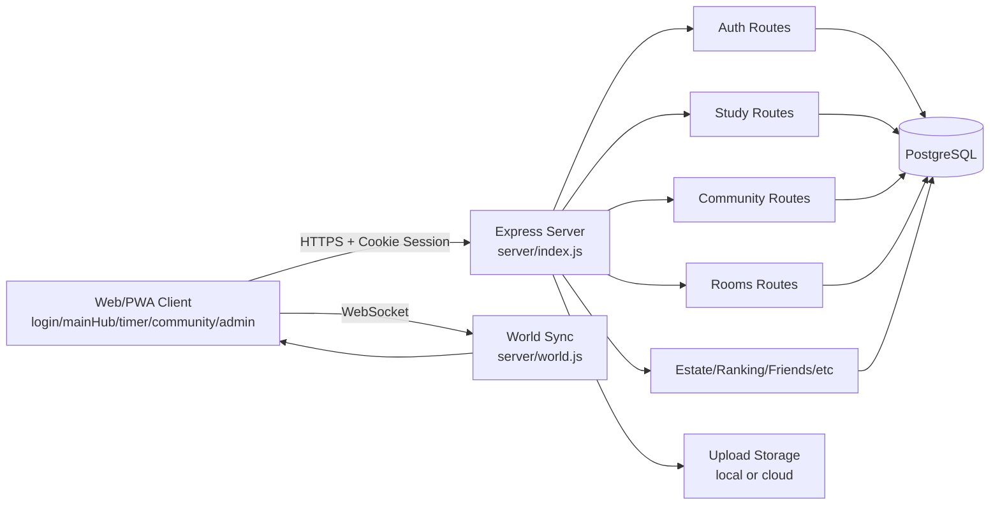

# P.A.T.H

공부 타이머 + 3D 월드 + 커뮤니티 + 스터디룸이 결합된 웹/PWA 서비스입니다.

- 백엔드: Express, PostgreSQL, Socket.IO
- 프론트엔드: 정적 HTML/CSS/JS + Three.js
- 모바일: Capacitor(Android/iOS)

## 주요 기능

### 1) 인증/계정
- 닉네임/비밀번호 회원가입, 로그인
- Google OAuth 로그인
- Apple OAuth 로그인
- 소셜 계정 기반 복구 안내(Google/Apple)
- 프로필 수정, 상태 메시지/이모지, 칭호 활성화

### 2) 메인 허브(3D 월드)
- Three.js 기반 월드 렌더링
- 실시간 사용자 입장/이동/외형 동기화(Socket.IO)
- 랭킹(전체/오늘), 알림, 친구 패널
- 상점(스킨/오오라/테마/지원권), 세금 수령
- 모의 지원(침공) 및 내 지원 내역

### 3) 공부 타이머
- 타이머/스톱워치 모드
- 공부 시작/완료 기록, 과목 관리
- 주간 계획(캘린더) CRUD
- 공부 증빙 이미지 업로드
- 카메라 인증, Wake Lock, 절전 밝기 제어(앱)

### 4) 그룹 스터디룸
- 방 생성/참가/검색/공개방 목록
- 방 통계/리더보드/채팅
- 데코 장착/구매, 기여도
- 역할 기반 권한(owner/manager/member)

### 5) 커뮤니티
- 게시글 목록/핫글/상세
- 검색/정렬(최신/좋아요/조회)
- 이미지 첨부 글쓰기, 댓글
- 추천/골드추천, 신고, 작성자 차단
- 관리자 게시글/댓글 삭제

### 6) 관리자
- 승인 대기(점수/GPA) 검토
- 사용자 목록 조회/수정
- 커뮤니티 신고 큐 처리
- 관리자 역할 관리(main/sub)

### 7) PWA/모바일
- Service Worker 캐시 전략
- 설치 배너(beforeinstallprompt), iOS 설치 안내
- Push/notification click 핸들링
- Capacitor 기반 Android/iOS 빌드 스크립트

## 기술 스택

- Runtime: Node.js
- Server: Express 5, express-session, connect-pg-simple
- DB: PostgreSQL (`pg`)
- Realtime: Socket.IO
- Security/ops: helmet, cors, compression, express-rate-limit
- Upload: multer
- 3D: three
- Mobile: Capacitor

## 프로젝트 구조

```text
P.A.T.H/                 # 웹 정적 자산(페이지별)
  login/
  mainHub/
  mainPageDev/           # timer 페이지
  community/
  setup-profile/
  admin/
  legal/
server/
  index.js               # 서버 엔트리
  schema.js              # DB 스키마/마이그레이션
  world.js               # 월드 실시간 동기화
  routes/                # 도메인별 API
  utils/
scripts/
  build-android.sh
```

## 빠른 시작

### 1) 설치

```bash
npm install
```

### 2) 환경변수 설정

최소 권장:

- `DATABASE_URL`: PostgreSQL 연결 문자열
- `SESSION_SECRET`: 세션 서명 키(운영 필수)
- `NODE_ENV`: `development` 또는 `production`

자주 쓰는 추가 변수:

- `CORS_ORIGIN`: 허용 오리진 CSV
- `SITE_URL`: 사이트 절대 URL(robots/sitemap/canonical)
- `SESSION_SAME_SITE`, `SESSION_COOKIE_DOMAIN`
- `USE_CLOUD_STORAGE`: 업로드 외부 스토리지 사용 여부

OAuth 변수(선택):

- `GOOGLE_CLIENT_ID`, `GOOGLE_CLIENT_SECRET`, `GOOGLE_REDIRECT_URI`
- `GOOGLE_REDIRECT_URI_APP` (앱에서 별도 콜백 URI 사용 시)
- `GOOGLE_AUTH_SUCCESS_REDIRECT`, `GOOGLE_AUTH_ERROR_REDIRECT`
- `GOOGLE_AUTH_SUCCESS_REDIRECT_APP`, `GOOGLE_AUTH_ERROR_REDIRECT_APP`, `GOOGLE_AUTH_SETUP_REDIRECT_APP`
- `APPLE_CLIENT_ID`, `APPLE_CLIENT_SECRET`, `APPLE_REDIRECT_URI`
- `APPLE_REDIRECT_URI_APP` (앱에서 별도 콜백 URI 사용 시)
- `APPLE_AUTH_SUCCESS_REDIRECT`, `APPLE_AUTH_ERROR_REDIRECT`
- `APPLE_AUTH_SUCCESS_REDIRECT_APP`, `APPLE_AUTH_ERROR_REDIRECT_APP`, `APPLE_AUTH_SETUP_REDIRECT_APP`

Apple Client Secret(JWT) 생성:

1. Apple Developer에서 Key(.p8), Key ID, Team ID, Client ID(Services ID)를 준비합니다.
2. `.env`에 `APPLE_TEAM_ID`, `APPLE_KEY_ID`, `APPLE_CLIENT_ID`, `APPLE_PRIVATE_KEY_PATH`를 채웁니다.
3. 아래 명령으로 client secret JWT를 생성합니다.

```bash
npm run generate:apple-secret -- --out .apple-client-secret.jwt
```

4. 생성된 값을 `APPLE_CLIENT_SECRET`에 넣고 서버를 재시작합니다.

### 3) 실행

```bash
npm start
```

기본 포트: `5000`

## npm 스크립트

- `npm start`: 서버 실행
- `npm run univ:bootstrap`: 대학 카탈로그/파이프라인 초기화
- `npm run univ:report`: 수집 데이터 품질 리포트 출력
- `npm run univ:export`: 파이프라인 데이터를 `universities.real.json`으로 내보내기
- `npm run univ:policy`: 신뢰정책(minConfidence 등) 설정
- `npm run univ:collect`: manifest 기반 배치 수집(fetch+snapshot+import)
- `npm run univ:cli`: 대학 데이터 CLI 직접 실행
- `npm run validate:universities`: `server/data/universities.real.json` 형식 검증
- `npm run set-admin`: 관리자 권한 설정 스크립트 실행
- `npm run list-admins`: 관리자 목록 출력
- `npm run cap:sync`: Capacitor 동기화
- `npm run cap:add:android`, `npm run cap:add:ios`
- `npm run cap:android`, `npm run cap:ios`
- `npm run apk:debug`: 디버그 APK 빌드
- `npm run apk:release`: 릴리스 APK 빌드
- `npm run aab:release`: Play Store AAB 빌드

릴리스 업로드 번들 서명(필수):

```bash
export ANDROID_KEYSTORE_PATH=/abs/path/to/upload-keystore.jks
export ANDROID_KEYSTORE_PASSWORD=your_keystore_password
export ANDROID_KEY_ALIAS=upload
export ANDROID_KEY_PASSWORD=your_key_password
```

위 4개 환경변수가 없으면 `npm run apk:release`, `npm run aab:release`는 실패합니다.

## API 라우트 맵

서버에 마운트된 API prefix:

- `/api/auth`
- `/api/study`
- `/api/ranking`
- `/api/estate`
- `/api/invasion`
- `/api/notifications`
- `/api/admin`
- `/api/university`
- `/api/cam`
- `/api/friends`
- `/api/messages`
- `/api/community`
- `/api/rooms`

헬스체크:

- `GET /api/health`

## API 상세 명세 (요약 + 예시)

기본 사항:

- Base URL: 서버 도메인
- 인증: 세션 쿠키 기반 (`credentials: include`)
- Content-Type: `application/json` (파일 업로드는 `multipart/form-data`)

### 1) 인증/계정 (`/api/auth`)

회원가입

```http
POST /api/auth/register
Content-Type: application/json

{
  "nickname": "path_user",
  "password": "strong passphrase 123",
  "real_name": "홍길동",
  "university": "서울대학교"
}
```

```json
{
  "ok": true,
  "user": {
    "id": 101,
    "nickname": "path_user"
  }
}
```

로그인

```http
POST /api/auth/login
Content-Type: application/json

{
  "nickname": "path_user",
  "password": "strong passphrase 123"
}
```

```json
{
  "ok": true,
  "user": {
    "id": 101,
    "nickname": "path_user",
    "gold": 1200,
    "diamond": 10
  }
}
```

내 정보 조회

```http
GET /api/auth/me
```

```json
{
  "id": 101,
  "nickname": "path_user",
  "university": "서울대학교",
  "gold": 1200,
  "diamond": 10,
  "balloon_skin": "default",
  "balloon_aura": "none"
}
```

비밀번호 복구 옵션 조회

```http
GET /api/auth/password-recovery/options?nickname=<닉네임>
```

### 2) 공부 (`/api/study`)

공부 시작

```http
POST /api/study/start
Content-Type: application/json

{
  "target_sec": 3600,
  "mode": "timer",
  "subject_id": 3
}
```

공부 완료

```http
POST /api/study/complete
Content-Type: application/json

{
  "duration_sec": 3540,
  "result": "SUCCESS",
  "mode": "timer",
  "subject_id": 3
}
```

```json
{
  "ok": true,
  "record": {
    "id": 9001,
    "earned_gold": 45,
    "earned_exp": 18
  }
}
```

과목 조회/추가

```http
GET /api/study/subjects
POST /api/study/subjects
```

주간 계획

```http
GET /api/study/calendar/week?offset=0
POST /api/study/calendar/plan
PUT /api/study/calendar/plan/:id
DELETE /api/study/calendar/plan/:id
```

증빙 업로드

```http
POST /api/study/upload-proof
Content-Type: multipart/form-data
```

### 3) 랭킹 (`/api/ranking`)

```http
GET /api/ranking
GET /api/ranking/today
GET /api/ranking/me
GET /api/ranking/bounty
```

### 4) 자산/상점/결제 (`/api/estate`)

```http
GET /api/estate/tax
POST /api/estate/collect-tax
POST /api/estate/buy-ticket
GET /api/estate/skins
POST /api/estate/buy-skin
POST /api/estate/equip-skin
GET /api/estate/auras
POST /api/estate/buy-aura
POST /api/estate/equip-aura
GET /api/estate/themes
POST /api/estate/buy-theme
POST /api/estate/equip-theme
POST /api/estate/diamond/web/prepare
POST /api/estate/diamond/web/confirm
POST /api/estate/diamond/app/complete
```

스킨 구매 예시

```http
POST /api/estate/buy-skin
Content-Type: application/json

{
  "skin_id": "sakura",
  "price": 300
}
```

### 5) 친구/메시지/알림

친구 (`/api/friends`)

```http
GET /api/friends/list
GET /api/friends/requests
POST /api/friends/request
POST /api/friends/accept
POST /api/friends/reject
DELETE /api/friends/:targetId
GET /api/friends/status/:targetId
```

메시지 (`/api/messages`)

```http
GET /api/messages/conversations
GET /api/messages/group-conversations
GET /api/messages/conversation/:targetId
POST /api/messages/send
POST /api/messages/send-file
GET /api/messages/unread-count
```

알림 (`/api/notifications`)

```http
GET /api/notifications
POST /api/notifications/read-all
```

### 6) 커뮤니티 (`/api/community`)

목록/핫글/상세

```http
GET /api/community/posts?page=0&limit=20&category=전체&sort=latest&q=
GET /api/community/posts/hot
GET /api/community/posts/:id
```

작성/상호작용

```http
POST /api/community/uploads/image
POST /api/community/posts
POST /api/community/posts/:id/view
POST /api/community/posts/:id/like
POST /api/community/posts/:id/gold-like
GET /api/community/posts/:id/comments
POST /api/community/posts/:id/comments
POST /api/community/posts/:id/report
POST /api/community/blocks/:userId
DELETE /api/community/blocks/:userId
```

게시글 작성 예시

```http
POST /api/community/posts
Content-Type: application/json

{
  "title": "국어 모의고사 공부법 공유",
  "content": "비문학 지문 구조화를 이렇게 연습했습니다.",
  "category": "정보",
  "image_url": ""
}
```

### 7) 스터디룸 (`/api/rooms`)

```http
GET /api/rooms/my
GET /api/rooms/public
POST /api/rooms
GET /api/rooms/by-invite/:code
GET /api/rooms/:id
PATCH /api/rooms/:id
POST /api/rooms/join/:code
DELETE /api/rooms/:id/leave
DELETE /api/rooms/:id
PATCH /api/rooms/:id/members/:userId/role
GET /api/rooms/:id/stats
GET /api/rooms/:id/leaderboard
GET /api/rooms/:id/messages
POST /api/rooms/:id/messages
GET /api/rooms/:id/decor
POST /api/rooms/:id/shop/buy
POST /api/rooms/:id/decor/equip
GET /api/rooms/:id/contributions
```

방 생성 예시

```http
POST /api/rooms
Content-Type: application/json

{
  "name": "수학 2시간 집중방",
  "goal": "오전 수학 루틴",
  "max_members": 8,
  "is_public": true
}
```

### 8) 대학/침공/캠/관리자

대학 (`/api/university`)

```http
GET /api/university/list
GET /api/university/data-status
GET /api/university/info?name=서울대학교
GET /api/university/search?q=서울
GET /api/university/compare-gpa?university=서울대학교&gpa=2.1
```

실데이터 반영 방법

- 기본값: `server/data/universities.js` 하드코딩 데이터 사용
- 실데이터 파일: `server/data/universities.real.json`
- 샘플 형식: `server/data/universities.real.sample.json`
- 반영 방식:
  - `universities`: 전체 데이터셋 교체
  - `patches`: 특정 대학만 부분 교체
- 반영 전 검증:

```bash
npm run validate:universities
```

- 로딩 상태 확인:

```http
GET /api/university/data-status
```

대학교 데이터 수집/정리/관리 파이프라인

- CLI: `scripts/university-data-cli.js`
- 관리 파일:
  - `server/data/university-catalog.json` (대학 기본 카탈로그)
  - `server/data/university-pipeline.json` (출처/원천 레코드)
  - `server/data/university-trust-policy.json` (신뢰정책)
  - `server/data/university-rejects.json` (정책 위반 레코드 리포트)
  - `server/data/source-manifest.json` (배치 수집 대상 목록)
  - `server/data/raw-snapshots/` (수집 원본 보관)
  - `server/data/university-import-template.csv` (CSV 템플릿)
  - `server/data/DATA_QUALITY_PLAYBOOK.md` (고품질 운영 체크리스트)

권장 운영 순서

```bash
# 1) 초기화
npm run univ:bootstrap

# 2) 출처 등록
npm run univ:cli -- add-source --id snu-2026 --name "서울대 입학처 2026" --url "https://admission.snu.ac.kr" --license "public"

# 3) CSV 반영 (템플릿: server/data/university-import-template.csv)
npm run univ:cli -- import-csv --file ./server/data/university-import-template.csv --source snu-2026 --year 2026

# 3-0) URL 없이 내장 데이터로 초기 시드 생성
npm run univ:cli -- seed-from-builtin --source builtin-seed-2026 --year 2026 --replace true

# 3-1) URL 자동수집 (csv/json)
npm run univ:cli -- import-url --url "https://example.com/univ-2026.csv" --format csv --source snu-2026 --year 2026

# 3-1-a) URL 자동수집 + 매핑 템플릿 적용
npm run univ:cli -- import-url --url "https://example.com/univ-2026.csv" --format csv --source snu-2026 --year 2026 --map ./server/data/source-maps/university-alimi.csv.map.json

# 3-2) 신뢰정책 설정
npm run univ:policy -- --minConfidence 0.8 --requireYear true --requireSourceUrl true

# 3-3) manifest 배치 수집
# (source-manifest.json에서 enabled=true인 소스만 수집)
npm run univ:collect

# 특정 소스만 테스트 수집
npm run univ:cli -- collect --source sample-university-alimi-2026 --dryRun true

# 4) 품질 점검
npm run univ:report

# 5) 서비스 반영 파일 생성 + 검증
npm run univ:export
npm run validate:universities
```

주의

- `univ:export`는 기본적으로 신뢰정책을 통과한 레코드만 반영합니다.
- 제외된 데이터는 `server/data/university-rejects.json`에 이유와 함께 기록됩니다.
- `validate:universities`는 admissions별 `sourceId`, `sourceUrl`, `year`, `confidence(0.5~1)`를 필수로 검사합니다.

CSV 헤더

```text
university,department,category,admissionsType,percentile,convertedCut,gpaCut,track,note,sourceUrl,confidence,year,sourceId
```

매핑 템플릿

- `server/data/source-maps/university-alimi.csv.map.json`
- `server/data/source-maps/adiga.csv.map.json`
- `server/data/source-maps/admission-office.generic.csv.map.json`

템플릿은 원본 CSV 컬럼명을 내부 표준 컬럼으로 매핑합니다. 컬럼명이 다르면 해당 파일을 복사해 `fields` 배열의 우선순위만 수정해서 사용하면 됩니다.

배치 수집 manifest 형식

```json
{
  "sources": [
    {
      "id": "sample-university-alimi-2026",
      "enabled": true,
      "url": "https://example.com/university-alimi-2026.csv",
      "format": "csv",
      "map": "./server/data/source-maps/university-alimi.csv.map.json",
      "year": 2026,
      "replace": true
    }
  ]
}
```

침공 (`/api/invasion`)

```http
POST /api/invasion/attack
GET /api/invasion/accept-prob
GET /api/invasion/my-applications
GET /api/invasion/logs
```

캠 (`/api/cam`)

```http
GET /api/cam/settings
POST /api/cam/settings
POST /api/cam/upload
GET /api/cam/recent
GET /api/cam/user/:userId
```

관리자 (`/api/admin`)

```http
GET /api/admin/pending
GET /api/admin/all-users
POST /api/admin/update-user
GET /api/admin/community-reports
POST /api/admin/community-reports/:id/review
POST /api/admin/approve-score
POST /api/admin/reject-score
POST /api/admin/approve-gpa
POST /api/admin/reject-gpa
GET /api/admin/roles
POST /api/admin/set-role
```

오류 응답 예시

```json
{
  "error": "잘못된 요청입니다."
}
```

## 화면 캡처 가이드

문서/홍보용 스크린샷은 아래 순서로 수집하는 것을 권장합니다.

1. 로그인 화면 (LOGIN/REGISTER 탭 포함)
2. 메인 허브 월드 전경 + 랭킹 패널
3. 상점(스킨/오오라/테마 탭)
4. 타이머 진행 중 화면 + 증빙 업로드 모달
5. 스터디룸 채팅/리더보드
6. 커뮤니티 목록/상세/댓글
7. 관리자 신고 큐 및 승인 화면

권장 캡처 규격:

- 웹: 1920x1080
- 모바일: 1080x2400
- 파일 형식: PNG

## 아키텍처 다이어그램



실시간/HTTP 분리 포인트:

- 상태 동기화(월드 이동/외형): WebSocket
- 영속 데이터 CRUD(게시글/공부기록/상점): HTTP API + PostgreSQL

## 권한/보안

- 세션 기반 인증 + PostgreSQL 세션 저장
- 주요 요청에 rate limit 적용
- CSRF 완화: 상태변경 요청에 Origin/Referer 검증
- 보안 헤더(helmet), CORS 제어

## 정적 라우팅

- `/login/`
- `/mainHub/`
- `/timer/`
- `/community/`
- `/setup-profile/`
- `/admin/`
- `/legal/`

루트(`/`) 접속 시 `/login/`으로 리다이렉트됩니다.

## 참고 문서

- `MOBILE_APP_SETUP.md`
- `PHONE_AUTH_SETUP.md`
- `PHONE_AUTH_IMPLEMENTATION.md`
- `APP_STORE_REVIEW_SAFETY_CHECKLIST.md`
- `DEPLOY_RENDER_CLOUDFLARE.md`
- `GOOGLE_ADS_SETUP.md`

## 라이선스

현재 `package.json` 기준 `ISC`로 설정되어 있습니다.
